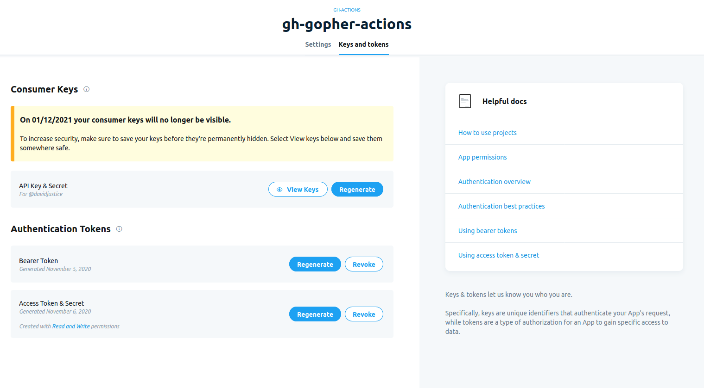

# Go Twitter GitHub Action
Golang based GitHub Action for sending out a tweet in your build. Why? Because sometimes you want to give
folks on your repo access to send out a tweet as new stuff is released.

## Inputs

### `message`

**Required** The tweet you would like to send

### `apiKey`

**Required** The API key under Consumer Keys in the [Twitter developer portal](https://developer.twitter.com/en/portal/projects-and-apps)

### `apiKeySecret`

**Requried** The API key secret under Consumer Keys in the [Twitter developer portal](https://developer.twitter.com/en/portal/projects-and-apps)

### `accessToken`

**Required** The access token under Authentication Tokens in the [Twitter developer portal](https://developer.twitter.com/en/portal/projects-and-apps)

### `accessTokenSecret`

**Required** The access token secret under Authentications Tokens in the [Twitter developer portal](https://developer.twitter.com/en/portal/projects-and-apps)

The developer portal area for keys and secrets look like the below image when this was written. All the input
names were selected to align with the UI.



## Outputs

### `errorMessage`

If there was an error, return it to you.

## Example usage
```
- uses: devigned/go-twitter-action@v1
  with:
    message: "Hey folks we just release a new version of ACME widgets!"
    apiKey: ${{ secrets.API_KEY }}
    apiKeySecret: ${{ secrets.API_KEY_SECRET }}
    accessToken: ${{ secrets.ACCESS_TOKEN }}
    accessTokenSecret: ${{ secrets.ACCESS_TOKEN_SECRET }}
```
